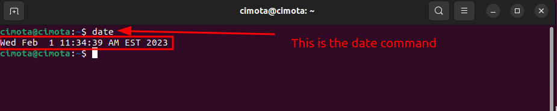
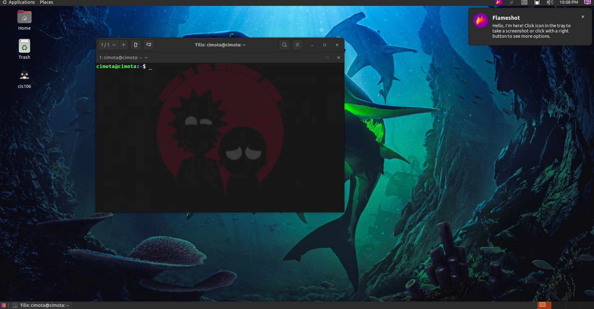

- - -
name: Clevis Mota
course: Linux Fundamentals
semester: Spring 23
- - -

# lab 3 Submission 

## Question 1

## Question 2

## Question 3

| Program purpose     | Package Name     | Version           |
| ------------------- | ---------------- | ----------------- |
| Play a tetris game  | blockattack      | 2.7.0-1           |
| Play a video file   | dragon player    | 4:21.123-0ubuntu1 |
| Browse the internet | epiphany-browser | 42.4-0ubuntu1     |
| Read your email     | geary            | 40.0-2            |
| Play music          | elisa            | 21.12.3-0ubuntu1  |

## Question 4

| command | what it does                                                                       |
| ------- | ---------------------------------------------------------------------------------- |
| echo    | display a line of text                                                             |
| fortune | prints out a random epigram                                                        |
| cowsay  | generates an ASCII picture of a cow saying something provided by the user          |
| lolcat  |  is  a  program  that  concatenates files, or standard input, to standard output (like the generic cat), and adds  rainbow  coloring  to it.|
| figlet  | prints  its  input  using large characters made up of  ordinary  screen characters |
| toilet  | prints text using large characters made of smaller characters                      |
| rig     | utility that will piece together a random first name, last name, street number and address, along with a geographically consistant city, state, ZIP code and area code|
