- - -
name: Clevis Mota
course: Linux Fundamentals
semester: Spring 23
- - -

# lab 4 Submission 

## Question 1.1  
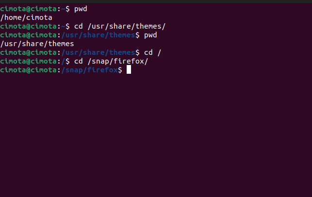   

## Question 1.2
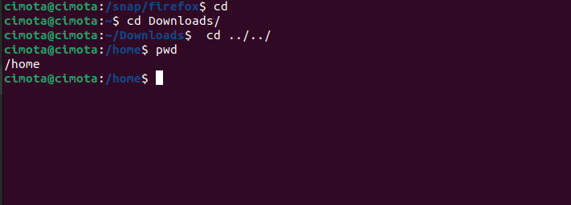 

## Question 2
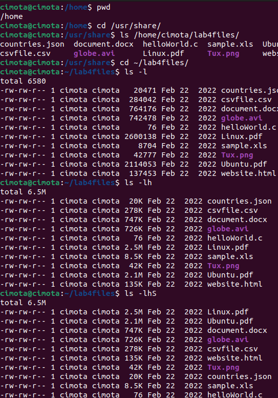 
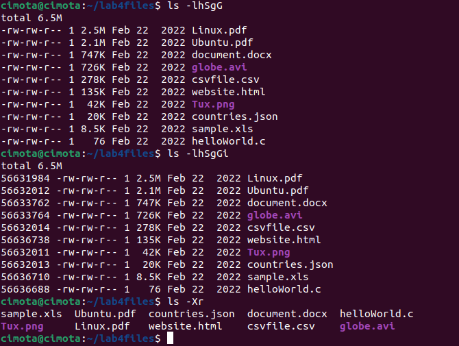 

## Question 3
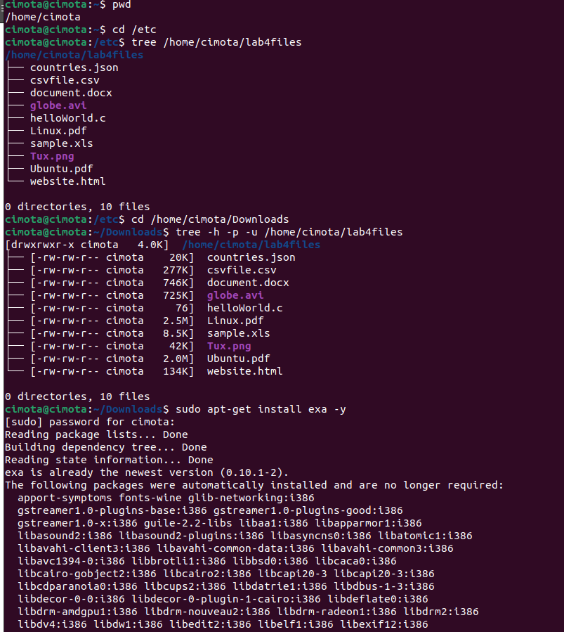 
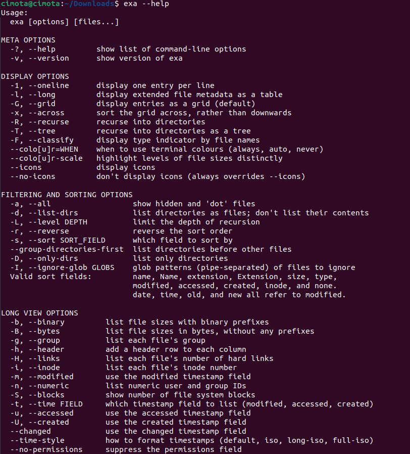 
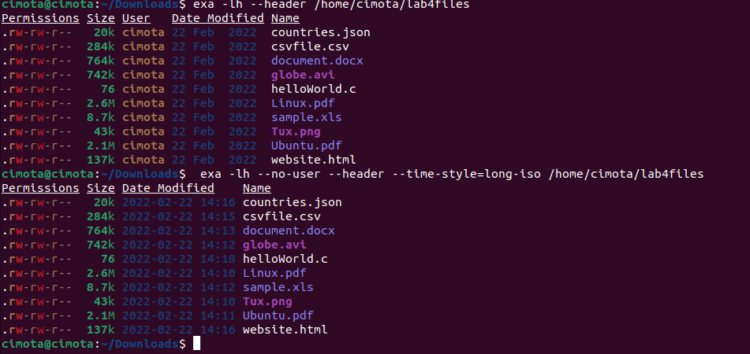 

## Question 4 
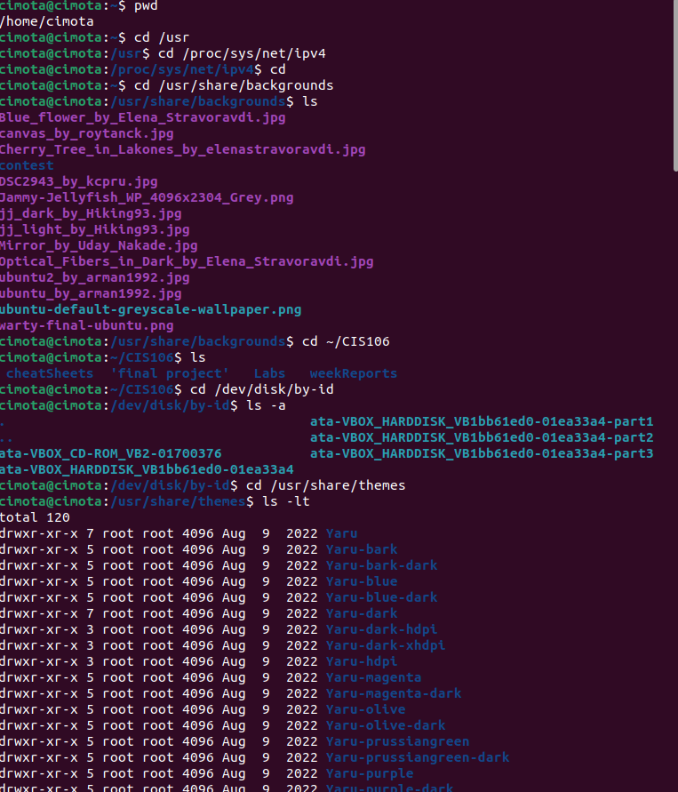 
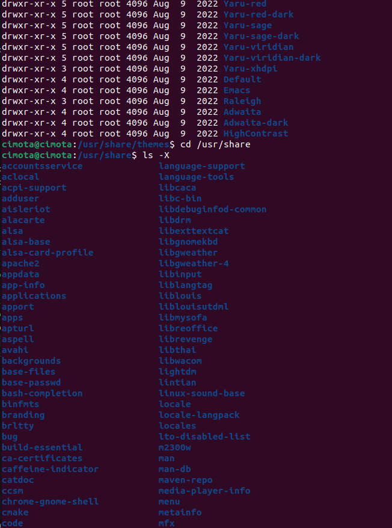 
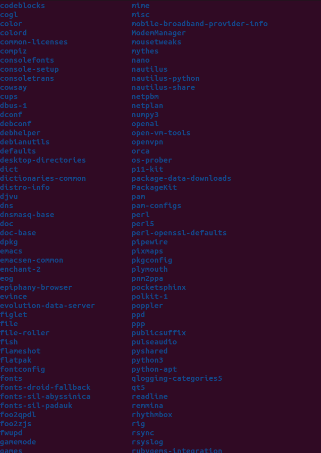 
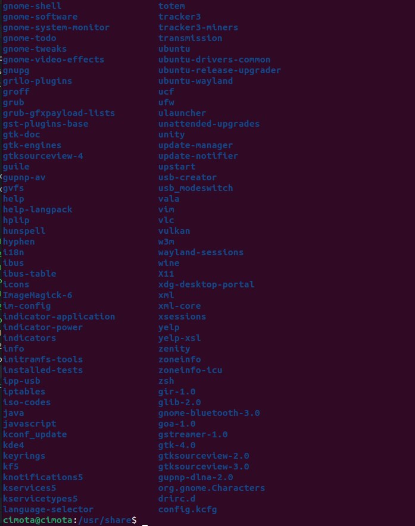 

## Question 5
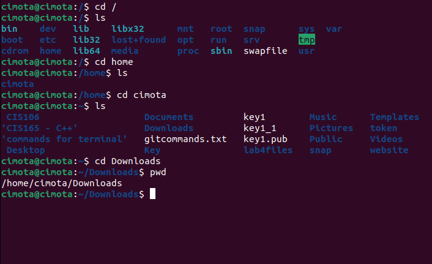 
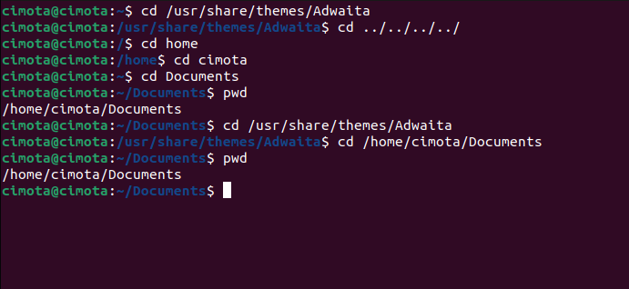 