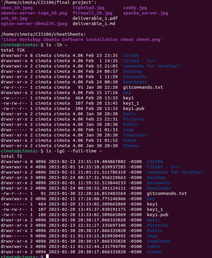

# Week Report 4

## Practice from the presentation The Linux File system:
### Practice 1

### Practice 2
 
 
### Practice 3
 
 

## The Linux File system directories and their purpose: 

 
 

## All the commands for navigating the filesystem 

| Command | What it does                         | Syntax                       | Example                 |
| ------- | ------------------------------------ | ---------------------------- | ----------------------- |
| cd      | change the current working directory | cd + directory + Documents   | `cd [directory]`        |
| pwd     | print the current working directory  | pwd + Enter key + Return key | `pwd`                   |
| ls      | list the files and directories       | ls + /path/to/directory      | `ls /path/to/directory` |

## Basic terminology 
* **File system** is a method for storing, organizing, and accessing files and directories on a storage device such as a hard drive or solid-state drive. A file system defines how files and directories are named, accessed, and managed on a storage device. It also specifies how the data is stored and retrieved from the storage device.
* **Current directory** is the directory or folder that is currently active or open in the command prompt or terminal window. When you type a command or run a program in the command prompt or terminal window, it will execute within the context of the current directory.
* **parent directory** is the directory that contains the current directory or folder. In a hierarchical file system, directories are arranged in a tree-like structure, with the root directory at the top and subdirectories branching off from it. Each directory can have one or more child directories, as well as a parent directory (except for the root directory, which has no parent directory).
* **the difference between your home directory and the home directory** "Your home directory" refers to the home directory of the currently logged-in user on a computer system. Each user account on a computer system has its own home directory, which is a default location for storing user-specific files, settings, and configurations. 
  On the other hand, "The home directory" refers to a standard directory on a Unix or Unix-like system that is used as the default location for a user's files and directories. The home directory is usually represented by the tilde character "~", and it is typically located in the root directory of the file system.
* **pathname** is a string of characters that specifies the unique location of a file or directory within a file system. It defines the full path, or the sequence of directories and subdirectories, from the root directory to the specific file or directory.
* **relative path** is a path that describes the location of a file or directory relative to the current working directory, rather than from the root directory.
  Relative paths are typically constructed using special symbols that represent the current directory (.), the parent directory (..), and the path separator (/ or , depending on the operating system).
* **absolute path**  is a complete path that describes the location of a file or directory within a file system, starting from the root directory.
   
   In an absolute path, every directory in the path is specified, beginning with the root directory, and each directory is separated by the path separator (/ or , depending on the operating system). This ensures that the path is unique and unambiguous, regardless of the current working directory.
   