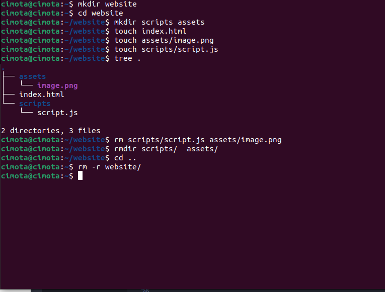
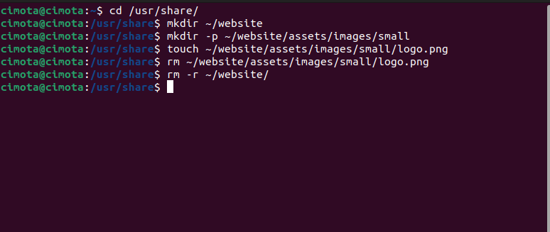
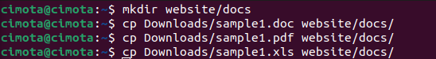

# Week Report 5

## Answers to the following questions:

**What are Command Options?**
Command options are additional parameters that can be added to a command in order to modify its behavior or to provide extra information. They are usually preceded by a hyphen or a double hyphen and are used to customize the way a command operates. Command options can vary depending on the operating system and the specific command being used, and they often have a short and a long form, which can be used interchangeably.  

**What are Command Arguments?**
Command arguments are inputs that are provided to a command when it is executed in the operating system. These inputs can be files, directories, or any other type of data that the command is designed to operate on or with. Command arguments are specified after the command name and any options, and they are often separated by spaces or commas. The specific format and requirements for command arguments can vary depending on the command and the operating system being used. Ultimately, command arguments enable users to specify the data or files they want a command to operate on, making it a powerful tool for managing and manipulating data in an operating system.  

**Which command is used for creating directories? Provide at least 3 examples.**
The command used for creating directories in most operating systems is "mkdir" which stands for "make directory". Here are three examples of how the `mkdir` command can be used to create directories:

 * To create a directory called " myfolder " in the current directory, use the following command:`mkdir myfolder`

 * To create a directory called " myfiles" inside an existing directory called "Documents", use the following command: `mkdir Documents/myfiles`

 * To create a directory called " myprojects " and all of its parent directories in a path that does not exist, use the "-p" option: `mkdir -p work/myprojects`

This will create a directory called " myprojects " inside a directory called " work " which will be created if it doesn't already exist, and all of its parent directories will be created as well.

**What does the touch command do? Provide at least 3 examples.**  
The touch command in Unix and Unix-like operating systems is used to create a new file or update the modification timestamp of an existing file without changing its contents. The syntax of the command is `touch [options] filename(s)`

Here are three examples of using the touch command:

* Creating a new file: You can use the touch command to create a new file with a specified name. If the file already exists, touch updates its modification time without changing the file's content. For example, to create a new file called myfile.txt, you can run the following command: `touch myfile.txt`  

* Updating the timestamp of an existing file: Sometimes you may want to update the timestamp of a file to the current time. You can use touch to do this without modifying the file contents. For example, to update the timestamp of an existing file called mydoc.doc, you can run the following command: `touch mydoc.doc`  
* Creating multiple files at once: You can use touch to create multiple files at once. To do this, specify the filenames separated by spaces. For example, to create three new files called file1.txt, file2.txt, and file3.txt, you can run the following command: `touch file1.txt file2.txt file3.txt`

**How do you remove a file? Provide an example.**  
To remove a file using the terminal in Unix and Unix-like operating systems, you can use the rm command. The syntax of the command is `rm [options] filename(s)`

Here is an example of how to remove a file using the terminal:

* Suppose you have a file called myfile.txt in your home directory that you want to delete. You can run the following command: `rm myfile.txt` 
This command will remove the file myfile.txt from your home directory.  
* If the file is write-protected or owned by another user, you may need to use sudo before the rm command to delete the file with root privileges. For example: `sudo rm myfile.txt` 
This will prompt you for your password and then delete the file with root privileges.

#### <b>It is important to note that the rm command permanently deletes files, and they cannot be recovered once they have been removed. Therefore, use this command with caution and make sure you have a backup copy of any important files before deleting them.</b>  

**How do you remove a directory and can you remove non-empty directories in Linux? Provide an example**  
To remove a directory in Linux using the terminal, you can use the `rmdir` or `rm` command. However, the `rmdir` command can only remove empty directories. If you want to remove a non-empty directory, you should use the rm command with the `-r` (recursive) option. Here is an example of how to remove a non-empty directory using the `rm` command. Suppose you have a directory called mydirectory in your home directory, and it contains several files and subdirectories. You can use the following command to remove it: `rm -r mydirectory` 
This command will recursively remove the directory mydirectory and all its contents, including any subdirectories and files within it. The `-r` option tells rm to remove the directory and its contents recursively.  

**Practice 1**

**Practice 2**

**Practice 3**

**Practice 4**
